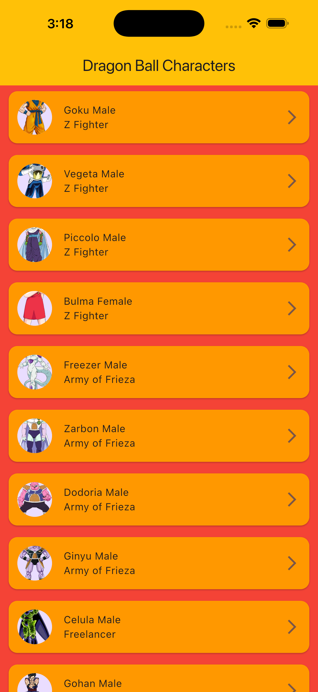
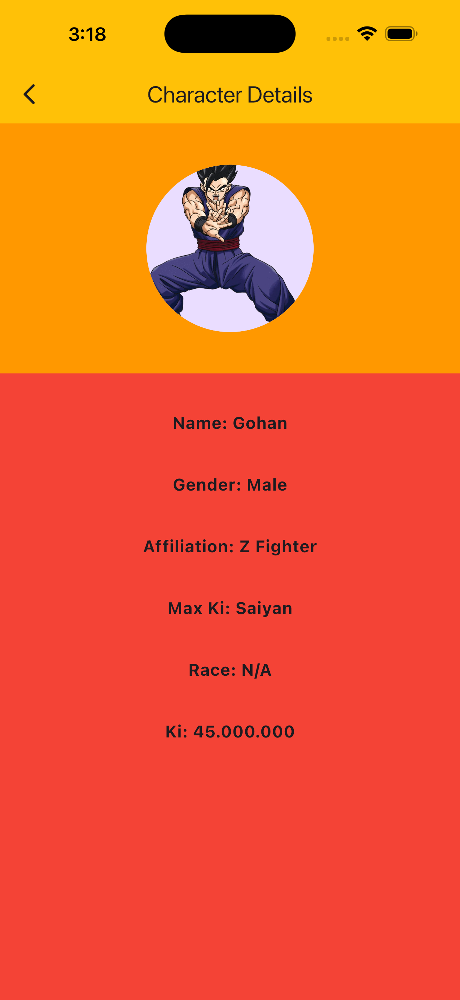

# Dragon Ball Characters App

This app was created using the Dragon Ball API https://dragonball-api.com/.
The chosen API was this because it's simple since it give us all the data required with
just one endpoint.

## App behavior

When the app starts the first thing that it does is show the characters list.

The characters screen initialize with a loading indicator due a the http request, if it is success will show
the character list, otherwise a centered error message will be show on the screen. Lastly
if a list's item is pressed the user will navigate to the characters detail screen.

The details screen show all the character information.

